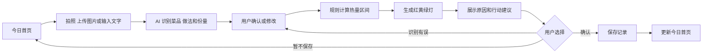
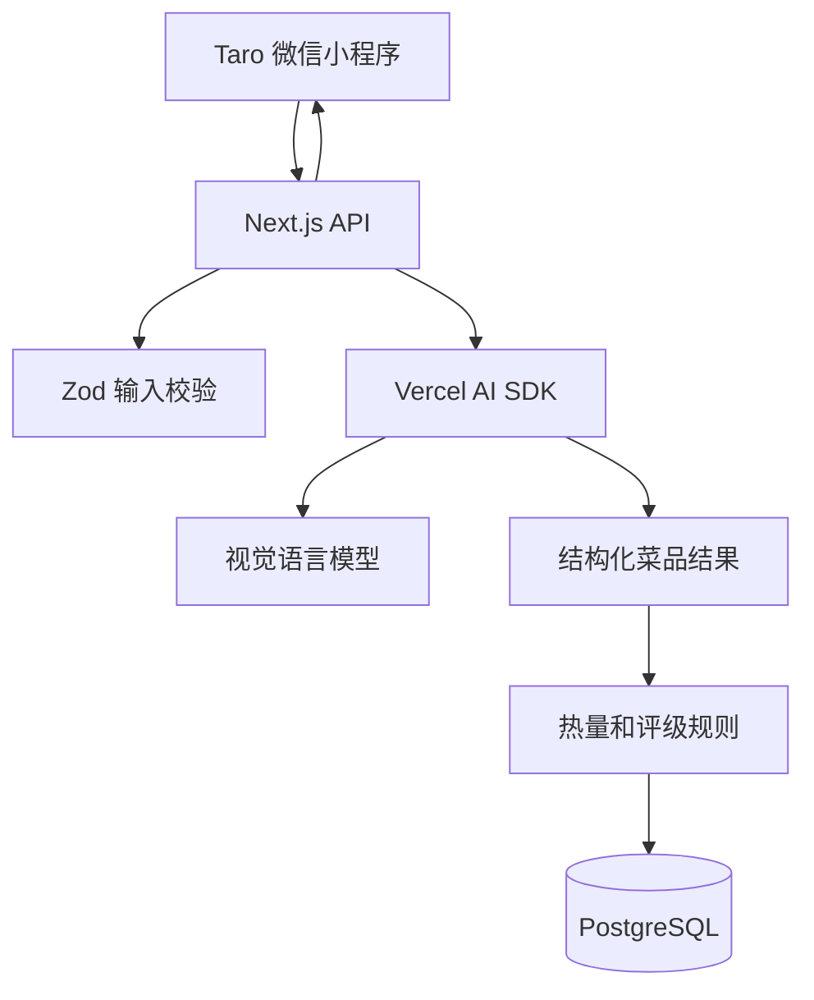

# 食刻 AI 作品集 MVP 产品需求文档

> 文档版本：V0.3  
> 产品阶段：AI 产品经理实习作品集 MVP  
> 更新时间：2026-09-09  
> 时间预算：80 小时，建议 3 至 4 周完成  
> 现金预算：不超过 300 元  
> 适用读者：产品、设计、开发、测试及面试评审者

## 0. 项目摘要

### 0.1 这是什么产品

食刻 AI 是一个帮助用户判断中式外卖“能不能吃、怎么吃更合适”的微信小程序 Demo。

用户不需要称重，也不需要在食物库中逐项搜索。只要上传一张餐食照片、外卖菜单截图，或者输入一句“我准备吃青椒肉丝盖饭”，系统就会：

1. 识别主要菜品、食材、烹饪方式和大致份量；
2. 给出热量与三大营养素的估算区间；
3. 根据用户当天的建议额度给出绿灯、黄灯或红灯；
4. 解释评级原因，并提供一个可以立即执行的调整建议；
5. 用户确认后，将这顿饭记入当天记录。

### 0.2 产品定位

**一句话定位：** 食刻 AI 不是要求用户精确称重的热量记账工具，而是帮助用户面对非标准中式外卖时，快速做出“吃什么、吃多少、怎么吃”决定的 AI 饮食向导。

**产品类别：** 轻量饮食决策工具，不是医疗、诊断或专业营养处方工具。

**核心场景：** 工作日午餐或晚餐前后，用户希望快速判断一顿中式外卖是否适合自己，并顺手完成记录。

**作品集要证明的能力：** 能从用户痛点出发定义 MVP，合理划分 AI 与规则的边界，设计可评测的 AI 功能，并完成一个可以演示的产品闭环。

### 0.3 MVP 核心假设

如果用户可以用图片或一句话完成餐食输入，并直接获得简单、可解释、能执行的建议，那么他们会比使用传统手动记账工具更愿意完成一次记录。

本项目不尝试证明图片能够精确测量热量，而是验证以下三件事：

- 低门槛输入是否减少记录阻力；
- 红黄绿灯是否降低判断难度；
- 具体的吃法建议是否比单纯展示热量更有帮助。

### 0.4 项目约束

| 项目 | 约束 |
| --- | --- |
| 产品形态 | 微信小程序开发版、体验版或开发者工具 Demo |
| 页面数量 | 5 个核心页面 |
| 输入方式 | 图片和文字 |
| AI 模型 | 只接入一个可识图的大模型 |
| 用户系统 | 匿名演示用户，不做正式微信登录 |
| 数据范围 | 先覆盖 30 至 50 个代表性中式外卖样本 |
| 开发时间 | 总计不超过 80 小时 |
| 现金成本 | 总计不超过 300 元 |
| 最终交付 | 可运行 Demo、演示视频、PRD、评测报告和复盘材料 |

## 1. 用户与问题

### 1.1 核心用户

- 22 至 32 岁的一二线城市职场人；
- 有减脂、塑形或维持体重需求；
- 工作日经常吃中式外卖、食堂餐或便利店便当；
- 有健康意识，但不愿意称重、查克数或阅读复杂图表；
- 常在点餐前、开吃前或吃完后临时做判断，时间和耐心都有限。

性别不是产品限制。首轮用户访谈可以优先寻找有外卖和减脂习惯的年轻职场人。

### 1.2 典型场景

一名 26 岁的职场用户准备点午餐。她想吃“干煸芸豆 + 溜肉段 + 米饭”，但不知道这份餐是否会明显超过今天的计划。

她将外卖菜单截图上传到食刻 AI。系统识别出菜品和烹饪方式，展示热量区间、估算可信度和黄灯结果，并提示：“这两道菜都可能用油较多。可以保留溜肉段，把米饭减半；如果方便，再将芸豆换成清炒时蔬。”她接受建议并完成记录。

### 1.3 主要痛点

| 痛点 | 典型表现 | 产品机会 |
| --- | --- | --- |
| 记录太麻烦 | 要搜索多个菜名、选择份量并填写克数 | 用图片或一句话代替多次手动输入 |
| 中式外卖难估算 | 同一道菜因厨师、用油和份量不同而差异很大 | 给出诚实的区间和可信度，而不是伪精确数字 |
| 看懂数字仍不会选择 | 用户看到 700 千卡后仍不知道现在能不能吃 | 将复杂数据转成当前的红黄绿灯 |
| 高热量提示容易制造挫败感 | 产品只告诉用户“超标”，不给解决方法 | 每次评级都附带现实可执行的调整建议 |
| AI 容易看错或乱编 | 模型误认菜品、漏看油炸做法或直接编热量 | 用户确认识别结果，数值和评级由规则计算 |

### 1.4 用户要完成的任务

当用户面对一顿中式外卖时，希望用尽量少的操作知道：

- 这顿饭大概包含什么；
- 热量大致在什么范围；
- 按照今天的情况是否合适；
- 如果仍然想吃，怎样调整最现实；
- 调整后能否立即保存记录。

### 1.5 暂不作为目标用户

- 未成年人；
- 孕期、哺乳期或有临床营养治疗需求的人群；
- 需要精确营养控制的专业运动员；
- 已确诊或疑似存在进食障碍、需要专业支持的人群。

作品集 Demo 不收集真实敏感健康数据。测试时优先使用虚构用户资料和公开餐食图片。

## 2. 产品原则与术语说明

### 2.1 产品原则

1. **先给决定，再给数据。** 结果页首先回答“现在怎么做”，详细营养数据放在次要位置。
2. **展示区间，不制造假精确。** 无法确认重量和用油量时，必须显示估算范围与可信度。
3. **评价当前选择，不评价用户本人。** 不使用“罪恶、放纵、不自律”等羞辱性表达。
4. **AI 负责理解和表达，规则负责数字和评级。** 大模型不能直接决定最终热量或红黄绿灯。
5. **建议必须能在当下完成。** 优先建议减饭、少汁、去皮、少吃一部分或替换一道菜。
6. **先完成闭环，再增加功能。** 任何不能直接帮助主流程的功能都不进入本次 MVP。

### 2.2 抽象术语的通俗解释

| 原术语 | 通俗说法 | 产品中的含义 |
| --- | --- | --- |
| 多模态解析 | 看懂图片和文字 | 从照片、截图或一句话中找出菜品、做法和份量 |
| 烹饪暗税 | 做法带来的额外油糖 | 油炸、干煸、糖醋等做法会让食材增加额外热量 |
| 动态热量汇率 | 结合今天剩余额度判断 | 食物是否适合当前这顿，要看用户今天已经吃了多少，而不是永久贴上好坏标签 |
| 餐食情绪角色 | 用户这次为什么想吃 | 识别“为了吃饱、补营养或解馋”，用于调整建议语气；不作为 MVP 必做字段 |
| 规则引擎 | 固定且可检查的计算公式 | 根据食材、份量和做法计算区间，并稳定输出评级 |
| VLM | 能看图片的大模型 | 负责从餐食照片或菜单截图中识别菜品和做法 |
| 降级模式 | AI 失败时的备用方案 | 图片识别失败后保留输入，并引导用户改用文字 |

时间不应被简单解释为“晚上吃同一种食物一定更差”。MVP 中，时间只用于估算当天还剩几餐，不单独作为惩罚性降级依据。

## 3. MVP 功能范围

### 3.1 唯一核心闭环

**上传图片或输入菜名 -> AI 识别 -> 用户确认 -> 规则计算 -> 展示评级和建议 -> 保存记录。**

### 3.2 P0 必做功能

#### F1 演示用户资料

首次使用时提供一组默认的演示资料，包括目标方向、建议的每日摄入范围和忌口。用户可以在首页修改少量参数，但不做完整注册和账号体系。

验收标准：

- 默认资料能直接支持完整演示；
- 用户可以调整目标和每日建议范围；
- 所有资料只服务于 Demo，不声称构成专业营养建议；
- 不要求手机号、身份证或真实身体健康信息。

#### F2 图片和文字输入

用户可以上传一张餐食照片、外卖菜单截图，或者输入一句餐食描述。

验收标准：

- 支持微信相册、相机和文字输入；
- 一次只处理一张图片；
- 上传前压缩图片，避免无意义的调用成本；
- 图片权限拒绝、上传失败和图片模糊时有明确提示；
- 文字输入始终作为图片识别失败时的备用入口。

#### F3 AI 识别与用户确认

系统将输入转换成结构化的菜品、烹饪方式、份量档位和可信度。用户在计算前确认或修改结果。

验收标准：

- 可以删除错误菜品、添加漏识别菜品；
- 可以修改做法和“小份、正常份、大份”三个份量档位；
- 显示“较确定、可能、不确定”三档可信度；
- 未经用户确认，不生成最终评级，也不保存记录。

#### F4 热量区间与红黄绿灯

系统根据用户确认后的食材、份量和烹饪方式，使用规则计算热量区间，并与当天建议额度比较。

验收标准：

- 展示类似“约 650 至 850 千卡”的区间，不展示伪精确结果；
- 展示导致区间变宽的原因，例如“无法确认实际用油量”；
- 红黄绿灯由规则输出，不能由大模型自由决定；
- 颜色之外同时显示图标和文字。

#### F5 解释和行动建议

结果页展示一条主要原因和一至两条现实可执行的建议。

验收标准：

- 建议必须对应识别到的菜品；
- 优先使用米饭减半、少汁、去皮、少吃一部分或替换一道菜等动作；
- 不输出羞辱、绝对禁止、医疗处方或补偿性节食建议；
- 至少准备一套规则模板，在大模型生成失败时仍能展示建议。

#### F6 保存和查看记录

用户确认后，将结果保存到当天记录。首页和历史记录页同步更新。

验收标准：

- 保存菜品、热量区间、评级、建议和记录时间；
- 用户能查看最近记录；
- 用户能删除一条记录；
- 删除后首页汇总自动更新。

### 3.3 P1 有剩余时间再做

- “米饭减半、只吃一半、少汁”调整按钮；
- 调整后重新计算热量区间和评级；
- 对识别结果进行“正确或错误”快速反馈；
- 最近一次餐食的一键复用；
- 简单的结果分享图片。

P1 不得挤占主流程、评测集和演示材料的时间。

### 3.4 本次明确不做

- 语音输入和语音转文字；
- 正式微信登录、手机号登录和 `better-auth`；
- 公开发布、商业认证和支付；
- 全天或全周 AI 食谱；
- 附近商家、真实库存、价格和外卖下单；
- 条形码和完整包装食品 SKU 数据库；
- 精确克数调整和复杂营养图表；
- 社区、排行榜、好友监督和教练端；
- 体脂秤、运动手表和健康平台同步；
- 邮件、支付、国际化和完整运营后台；
- Redis、消息队列和复杂微服务；
- 多模型路由和自动模型切换；
- 商业化、广告和商城。

## 4. 页面清单

MVP 只做 5 个核心页面。使用说明、演示资料和简单设置并入现有页面，不再拆成独立页面。

| 编号 | 页面 | 用户目的 | 核心内容 |
| --- | --- | --- | --- |
| P01 | 今日首页 | 查看当天状态并开始分析 | 演示用户目标、今日热量区间、最近记录、拍照和文字入口 |
| P02 | 餐食输入页 | 提交一顿饭 | 拍照、相册、文字输入、示例、提交按钮 |
| P03 | 识别确认页 | 修正 AI 结果 | 菜品列表、做法、份量、可信度、增删改 |
| P04 | 评估结果页 | 判断现在怎么吃 | 红黄绿灯、热量区间、主要原因、行动建议、保存按钮 |
| P05 | 历史与设置页 | 查看记录并调整 Demo 参数 | 最近记录、删除、每日建议范围、免责声明 |

### 4.1 页面关键状态

- 首页没有记录；
- 图片上传中和 AI 分析中；
- 相机或相册权限被拒绝；
- 上传失败、网络失败或 AI 超时；
- 图片中没有检测到餐食；
- 识别可信度较低，需要用户补充菜名；
- 记录保存成功或失败；
- 历史记录为空。

## 5. 核心流程

### 5.1 主流程



### 5.2 图片输入流程

1. 用户在首页点击拍照或相册；
2. 小程序取得权限并读取一张图片；
3. 前端压缩图片后提交给后端；
4. 后端调用视觉模型并校验结构化结果；
5. 前端展示识别确认页；
6. 用户修改或确认菜品、做法和份量；
7. 后端规则引擎计算热量区间与评级；
8. 结果页展示原因和建议；
9. 用户保存记录，首页汇总更新。

### 5.3 文字输入流程

1. 用户输入“干煸芸豆、溜肉段和一碗米饭”；
2. 后端使用同一个模型抽取菜品、做法和份量；
3. 用户确认结果；
4. 后续计算、展示和保存流程与图片输入一致。

### 5.4 失败与降级流程

1. 图片处理超过 4 秒时显示明确的分析进度；
2. 超过 12 秒或接口报错时停止等待；
3. 保留当前页面和已有文字；
4. 提示用户改用文字输入菜名；
5. 若模型输出格式不合法，后端返回可理解的错误，不进入规则计算；
6. 演示时准备两个本地样例，防止网络故障导致整个 Demo 无法展示。

## 6. AI 与规则设计

### 6.1 能力边界

| 能力 | AI 模型负责 | 规则和数据负责 |
| --- | --- | --- |
| 输入理解 | 从图片或文字中识别菜品、食材、做法和份量 | 校验字段并映射成标准词 |
| 热量估算 | 不直接给最终热量 | 根据食材、份量和做法计算区间 |
| 红黄绿灯 | 不直接决定评级 | 根据固定阈值输出评级 |
| 行动建议 | 将已批准的建议动作改写成人话 | 决定哪些动作可以使用，并过滤不安全建议 |
| 健康判断 | 不诊断疾病或进食障碍 | 展示固定免责声明和保护性文案 |

### 6.2 AI 结构化输出

```json
{
  "items": [
    {
      "displayName": "干煸芸豆",
      "ingredients": ["芸豆"],
      "cookingMethods": ["干煸"],
      "portionLevel": "regular",
      "confidence": 0.82,
      "uncertainties": ["无法判断实际用油量"]
    }
  ]
}
```

服务端使用 Zod 校验输出。字段缺失、枚举非法或没有识别到菜品时，返回确认或补充信息页面，不让错误结果进入计算。

### 6.3 热量区间计算

```text
餐食热量估算区间
= 食材基础热量区间
+ 份量档位调整
+ 烹饪方式带来的油糖附加区间
```

例如，系统不保存“鱼香茄子固定等于 680 千卡”，而是根据茄子、可能的肉末、酱汁、份量以及“过油、炒制、含糖酱汁”等因素给出较宽区间。

### 6.4 红黄绿灯初始规则

以下阈值只用于作品集 Demo，不代表正式营养标准：

1. 根据演示用户的每日建议范围，计算当前一餐的参考额度；
2. 用餐食热量区间上限除以本餐参考额度，得到额度占用比例；
3. 不超过 80%，且没有明显高油高糖做法时，暂定为绿灯；
4. 80% 至 120%，或存在明显高油高糖做法时，暂定为黄灯；
5. 超过 120% 时，暂定为红灯；
6. 低可信度时不输出强烈红灯结论，先要求用户确认；
7. 时间只影响剩余餐次分配，不直接把夜间食物判得更差。

### 6.5 建议动作白名单

大模型只能从以下动作中选择并改写：

- 米饭减少到一半；
- 少吃一部分高油菜品；
- 去皮；
- 少蘸或分离酱汁；
- 过水或沥去明显油汁；
- 将一道高油菜替换为清炒或水煮蔬菜；
- 保持当前选择，无需额外调整。

不允许生成绝食、催吐、使用药物、跳过下一餐或其他补偿性行为建议。

## 7. 技术方案

### 7.1 精简技术栈

| 层级 | MVP 选择 | 说明 |
| --- | --- | --- |
| 小程序前端 | Taro + React + TypeScript | 保留 React 开发体验并编译为微信小程序 |
| UI | TDesign MiniProgram + SCSS | 比直接迁移 shadcn/ui 更稳定 |
| 状态管理 | 页面状态为主，Jotai 可选 | 五个页面不需要复杂全局状态 |
| 服务端 | Next.js Route Handlers + TypeScript | 提供 AI、计算和记录接口 |
| AI 调用 | Vercel AI SDK | 只在服务端使用，统一结构化输出 |
| 数据校验 | Zod | 校验模型输出和接口参数 |
| 数据访问 | Prisma | 管理数据库模型和查询 |
| 数据库 | PostgreSQL | 保存演示用户、餐食、规则和结果 |
| 图片处理 | 请求内临时处理，完成后删除 | MVP 不建立长期图片素材库 |
| 部署 | 本地演示优先，必要时使用低成本云服务 | 不为公开上线提前建设复杂基础设施 |

本次不使用 shadcn/ui、Framer Motion、better-auth、Redis、邮件、支付和国际化。shadcn/ui 与 Framer Motion 可以留给未来的 Web 管理后台，但不用于微信小程序。

### 7.2 系统结构



### 7.3 最小目录结构

```text
apps/
├── miniprogram/       # Taro 微信小程序
└── server/            # Next.js API

packages/
├── shared/            # Zod Schema、共享类型和常量
└── nutrition/         # 食材、做法系数和评级规则
```

不创建 `auth`、`mail`、`payments`、`i18n`、`logs` 等独立包。等项目真的出现对应需求后再拆分。

### 7.4 核心数据对象

| 数据对象 | 关键字段 |
| --- | --- |
| DemoProfile | 演示用户编号、目标、每日建议范围、忌口 |
| MealInput | 输入类型、原始文字、图片临时信息、创建时间 |
| ParsedMeal | 菜品、做法、份量、可信度、不确定性、模型版本 |
| FoodRule | 食材基础区间、烹饪附加区间、规则版本 |
| MealAssessment | 总热量区间、评级、原因和行动建议 |
| MealRecord | 最终确认结果、记录时间和删除状态 |
| EvaluationCase | 测试输入、期望结果、实际结果和失败原因 |

### 7.5 最小接口

| 方法与路径 | 用途 |
| --- | --- |
| `POST /api/parse-meal` | 接收图片或文字并返回结构化识别结果 |
| `POST /api/assess-meal` | 根据确认内容计算热量区间、评级和建议 |
| `POST /api/meal-records` | 保存一条餐食记录 |
| `GET /api/meal-records` | 获取最近记录和当天汇总 |
| `DELETE /api/meal-records/{id}` | 删除一条记录并更新汇总 |

### 7.6 性能与成本控制

- 每次只允许上传一张经过压缩的图片；
- 文字输入和图片输入共用同一份结构化 Schema；
- AI 请求设置 12 秒超时，不做无限重试；
- 单次失败最多允许用户主动重试一次；
- 使用开发环境调用额度或设置 100 元硬性预算；
- 两个演示样例提供本地预置结果，保证面试演示不依赖实时网络；
- 不做 Redis、消息队列、多模型路由和自动扩容。

### 7.7 数据与隐私

- Demo 默认使用虚构用户资料；
- 不收集手机号、身份证、精确位置或真实疾病信息；
- 图片只为当次识别临时处理，不作为训练数据长期保存；
- 日志不记录完整原图和可识别个人身份的信息；
- 若邀请真实用户测试，事先说明图片会发送给第三方模型；
- 对外展示时明确声明结果仅为估算和一般健康信息。

## 8. 评测方案

评测是本作品集最重要的组成部分之一。Demo 能运行只能说明功能被实现，评测结果才能说明团队知道 AI 能力是否可靠。

### 8.1 评测目标

- 模型能否稳定返回合法的结构化数据；
- 能否正确识别主要菜品；
- 能否正确识别影响热量的重要做法；
- 模型不确定时是否会承认不确定；
- 规则是否会稳定输出相同的热量区间和评级；
- 建议是否具体、相关且没有明显安全问题。

### 8.2 评测集规模

准备 30 至 50 个样本，最低要求为 30 个。

| 样本类型 | 建议数量 | 示例 |
| --- | ---: | --- |
| 单道常见菜 | 8 | 红烧肉、清炒西兰花、番茄炒蛋 |
| 多菜组合 | 8 | 干煸芸豆 + 溜肉段 + 米饭 |
| 高油或高糖做法 | 6 | 油炸、干煸、糖醋、拔丝 |
| 图片质量问题 | 4 | 模糊、遮挡、光线较暗 |
| 相似或易混淆菜品 | 4 | 水煮肉片与酸菜鱼、炸鸡与烤鸡 |
| 可选扩展样本 | 0 至 20 | 地方菜、食堂套餐、便利店便当 |

### 8.3 每个样本的记录格式

```text
样本编号：E-001
输入：干煸芸豆 + 溜肉段 + 米饭的菜单截图
期望菜品：干煸芸豆、溜肉段、米饭
期望关键做法：干煸、溜
预期风险：两道菜都可能用油较多
实际识别：
实际评级：
是否需要用户修正：
建议是否相关：
失败原因：
改进动作：Prompt / Schema / 规则 / UI
```

### 8.4 核心评测指标

| 指标 | 计算方式 | 作品集目标 |
| --- | --- | --- |
| 结构化输出成功率 | 合法 JSON 且通过 Zod 校验的样本数 / 总样本数 | >= 95% |
| 主要菜品识别准确率 | 主要菜品识别正确的样本数 / 总样本数 | >= 80% |
| 关键做法识别准确率 | 高油高糖做法识别正确的样本数 / 相关样本数 | >= 80% |
| 严重误判数 | 将明显高油菜判断为低油且无提示的样本数 | <= 2 个 |
| 建议相关率 | 建议与已识别菜品直接相关的样本数 / 总样本数 | >= 85% |
| 主流程完成时间 | 从提交输入到保存记录 | 中位数 < 30 秒 |

这些目标只用于小样本作品集评测，不应包装成真实线上业务指标。

### 8.5 小规模用户测试

邀请 5 至 8 名符合目标特征的同学或朋友完成同一组任务：

1. 使用图片分析一顿饭；
2. 发现一处识别错误并修改；
3. 理解当前评级；
4. 选择一个行动建议；
5. 保存并在历史页找到记录。

观察完成率、卡住的位置、是否理解热量区间、是否觉得红黄绿灯有压力，以及建议是否愿意执行。不要要求测试者提供真实体重或健康信息。

## 9. 成功标准与埋点

### 9.1 作品集成功标准

本项目不以注册用户、周留存或商业收入作为完成标准。满足以下条件即可结束 MVP：

- 5 个核心页面可以完整演示；
- 图片和文字两种输入都能跑通；
- AI 输出经过结构化校验；
- 热量和评级由规则计算；
- 至少完成 30 条评测；
- 至少完成 5 名用户的可用性测试，或记录无法完成招募的原因；
- 有两个失败案例及对应迭代；
- 有 2 分钟左右的演示视频；
- 总投入不超过 80 小时和 300 元。

### 9.2 最小埋点

| 事件 | 触发时机 | 主要用途 |
| --- | --- | --- |
| `meal_input_submitted` | 提交图片或文字 | 区分输入方式并记录开始时间 |
| `meal_parse_completed` | AI 解析完成 | 记录耗时、模型版本和可信度 |
| `meal_parse_corrected` | 用户修改识别结果 | 分析模型最常看错什么 |
| `assessment_viewed` | 结果页展示 | 记录评级和规则版本 |
| `meal_recorded` | 保存记录 | 计算主流程完成率和总耗时 |
| `flow_abandoned` | 未保存便离开 | 找出退出步骤 |
| `ai_error` | AI 超时或格式错误 | 记录失败类型和降级结果 |

## 10. 主要风险与应对

| 编号 | 风险 | 对作品集的影响 | 应对方案 |
| --- | --- | --- | --- |
| R1 | 大模型看错菜品或做法 | 演示结果失真 | 用户确认后再计算；展示可信度；用评测集记录错误 |
| R2 | 模型直接编造精确热量 | 产品逻辑不可信 | 模型只输出标签，热量由规则计算并展示区间 |
| R3 | 中式外卖规则数据不充分 | 评级缺少依据 | 只覆盖代表性样本；标注规则来源和局限，不宣称专业精确 |
| R4 | 红灯文案制造羞耻感 | 产品价值和安全性受到质疑 | 使用中性表达；每次给解决动作；不建议补偿性节食 |
| R5 | 图片接口慢或面试现场网络失败 | 无法完成现场演示 | 准备文字入口和两个本地预置演示样例 |
| R6 | AI 调用成本失控 | 超过 300 元预算 | 压缩图片、限制重试、只接一个模型、设置 100 元调用上限 |
| R7 | 微信小程序兼容问题 | 页面和 Web 组件无法运行 | 使用 Taro 与 TDesign，不直接迁移 shadcn/ui 和 Framer Motion |
| R8 | 范围继续膨胀 | 80 小时内无法交付 | 冻结 P0，P1 不得影响评测和演示材料 |
| R9 | 为了上线耗费大量时间 | 偏离求职作品目标 | 使用开发版或体验版，不把公开审核当成交付条件 |
| R10 | 只展示界面，没有 AI 产品判断 | 面试价值有限 | 提供评测集、失败案例、AI 与规则边界及迭代记录 |
| R11 | 使用真实健康数据造成隐私问题 | 增加不必要的合规风险 | 使用虚构用户资料，不长期保存原图和敏感信息 |
| R12 | 时间分配失衡 | 代码完成但没有复盘材料 | 预留最后 10 小时制作视频和案例说明 |

## 11. 成本与时间计划

### 11.1 现金预算

| 项目 | 上限 | 说明 |
| --- | ---: | --- |
| AI 模型调用 | 100 元 | 设置硬性额度，优先使用开发免费额度 |
| 后端和数据库 | 100 元 | 本地优先，需要真机体验时再购买低成本云服务 |
| 域名和 HTTPS | 50 元 | 仅在体验版需要合法请求域名时购买；证书使用免费方案 |
| 图片存储 | 10 元 | 原则上临时处理，不长期存储 |
| 机动预算 | 40 元 | 处理部署或调用额度不足 |
| 合计 | **300 元** | 达到上限后不再扩充功能，改用本地演示 |

不购买小程序商业认证，不为作品集单独购买付费设计素材、邮件、短信、监控或管理后台服务。

### 11.2 80 小时时间盒

| 阶段 | 工作内容 | 时间上限 | 交付物 |
| --- | --- | ---: | --- |
| M1 产品定义 | PRD、页面草图、规则初稿、评测格式 | 10 小时 | 冻结后的 P0 清单 |
| M2 小程序界面 | Taro 项目、5 个页面、基础交互和状态 | 20 小时 | 可使用静态数据演示的前端 |
| M3 AI 解析 | 图片与文字输入、Schema、错误处理 | 14 小时 | 可校验的结构化输出 |
| M4 规则和记录 | 热量区间、评级、建议模板、数据库 | 14 小时 | 完整主流程 |
| M5 测试和迭代 | 30 条评测、5 名用户测试、缺陷修复 | 12 小时 | 评测结果和迭代记录 |
| M6 作品包装 | 演示视频、案例说明、截图和复盘 | 10 小时 | 可投递的作品集材料 |
| 合计 |  | **80 小时** |  |

### 11.3 停止规则

出现以下情况时必须缩减，不继续堆功能：

- 总投入达到 60 小时但主流程仍未跑通：删除 P1，并用预置数据完成结果页；
- AI 调用累计达到 80 元：停止大批量在线调试，改用保存的评测响应；
- 微信发布审核阻塞超过 2 小时：切回开发版和录屏演示；
- 数据库部署阻塞超过 4 小时：先使用本地 PostgreSQL 完成作品；
- 剩余时间不足 10 小时：停止编码，优先完成评测报告、视频和复盘。

## 12. 实施顺序

### 12.1 第一阶段 静态闭环

- 使用预置的干煸芸豆案例完成 5 个页面；
- 先用固定 JSON 模拟 AI 输出；
- 跑通确认、计算、评级、建议和保存；
- 确认页面结构后再接真实模型。

### 12.2 第二阶段 接入 AI

- 接入文字结构化解析；
- 再接入单张图片识别；
- 使用 Zod 拦截非法输出；
- 补充超时、空结果和低可信度状态。

### 12.3 第三阶段 建立评测

- 整理 30 条代表性样本；
- 记录首次评测结果；
- 选出至少两个典型失败案例；
- 分别从 Prompt、Schema、规则和界面层进行改进；
- 保存改进前后的对比。

### 12.4 第四阶段 作品集包装

- 录制约 2 分钟的完整演示；
- 输出一页项目摘要；
- 展示用户问题、MVP 取舍、系统流程、评测结果和失败迭代；
- 明确说明哪些能力是真实运行，哪些使用了演示数据；
- 准备一段 3 分钟的面试口述版本。

## 13. 作品集交付清单

### 13.1 必须交付

- [ ] 可运行的微信小程序开发版、体验版或开发者工具项目；
- [ ] 图片输入完整演示；
- [ ] 文字输入完整演示；
- [ ] 5 个页面的完整截图；
- [ ] 约 2 分钟的演示视频；
- [ ] 本 PRD；
- [ ] 30 至 50 条 AI 评测记录；
- [ ] 至少两个失败案例及改进前后对比；
- [ ] AI 与规则边界说明；
- [ ] 一页项目复盘。

### 13.2 面试时重点讲述

1. 为什么传统食物数据库难以处理非标准中式外卖；
2. 为什么图片估算应该显示区间，而不是精确数字；
3. 为什么让 AI 识别菜品，但不让 AI 直接计算热量和评级；
4. 为什么主动删除语音、登录、附近外卖和全天食谱；
5. 如何设计 30 条评测集以及模型最常失败的地方；
6. 如何从失败案例推动 Prompt、Schema、规则或交互迭代；
7. 如何处理健康表达、进食障碍倾向和用户隐私风险；
8. 如果再多两周，下一步会验证什么，而不是盲目增加功能。

## 14. MVP 验收清单

### 14.1 功能

- [ ] 图片和文字两种输入均能进入识别确认页；
- [ ] 用户可以修改菜品、做法和份量；
- [ ] 所有估算都显示区间和可信度；
- [ ] 红黄绿灯同时显示颜色、文字和图标；
- [ ] 每个结果包含一个原因和至少一个行动建议；
- [ ] 用户确认后才能保存记录；
- [ ] 历史记录可以查看和删除；
- [ ] 图片识别失败后可以切换为文字输入；
- [ ] 两个本地演示样例在无网络时仍可展示主流程。

### 14.2 AI 与数据

- [ ] 模型输出经过 Zod 校验；
- [ ] 热量和评级由规则计算；
- [ ] 至少完成 30 条评测；
- [ ] 结构化输出成功率达到 95%；
- [ ] 记录模型版本和规则版本；
- [ ] 至少保存两个失败案例和改进结果；
- [ ] AI 调用总成本没有超过 100 元。

### 14.3 内容与作品包装

- [ ] 不使用羞辱、绝对禁止或补偿性节食措辞；
- [ ] 不把估算宣传为精确测量；
- [ ] Demo 使用虚构用户资料；
- [ ] 演示中明确哪些内容使用预置数据；
- [ ] 演示视频、项目摘要、评测报告和复盘完整；
- [ ] 总投入不超过 80 小时和 300 元。

## 15. 后续版本但不在本次实施

| 版本 | 可能增加的能力 | 开始条件 |
| --- | --- | --- |
| V1.1 | 份量调整按钮、结果分享、最近餐食复用 | P0 完整且作品包装完成后仍有时间 |
| V1.5 | 语音输入、便利店和食堂场景、点餐前组合建议 | 图片和文字评测达到目标，并验证用户确实需要 |
| V2.0 | 正式登录、真实外卖平台、全天规划、好友或教练协作 | 项目从作品集转向真实创业或获得明确用户需求后 |

这些版本只用于展示产品演进思路，不属于当前开发任务。

## 16. 最终完成定义

食刻 AI 作品集 MVP 的完成标准不是“功能越多越好”，也不是通过微信正式上架。真正的完成是：一个用户能够上传餐食图片或输入菜名，确认 AI 的识别结果，看到由规则计算的热量区间和红黄绿灯，获得一条现实的行动建议，并保存这顿饭；同时项目具备一套可复现的评测、两个真实失败案例和清晰的取舍说明。

当这条闭环可以稳定演示，评测和复盘材料完整，并且总投入控制在 80 小时和 300 元以内，本次 MVP 即可结束。
